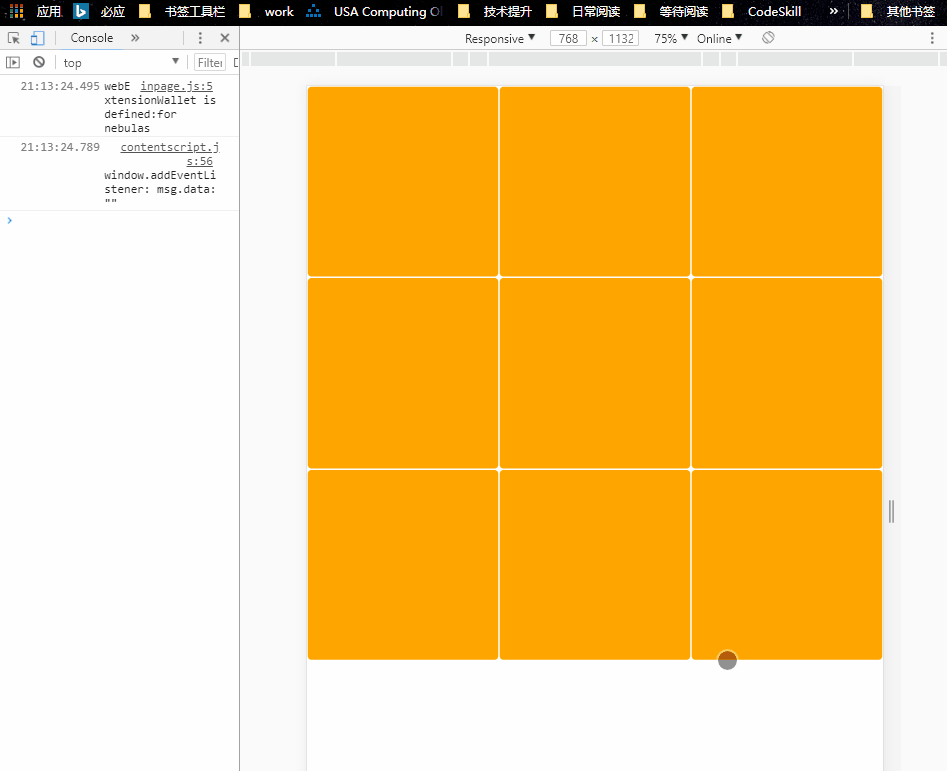
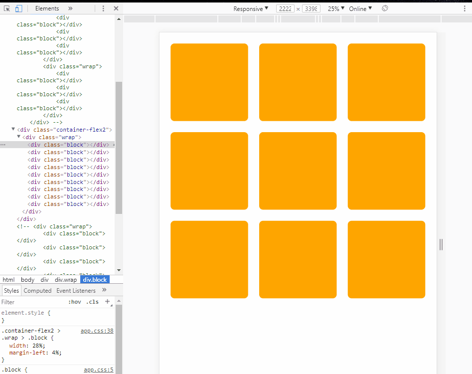

# 任务1:九宫格——用html+css制作一个网页

## 任务描述：

### 1.最终效果：

### 2.效果描述

圆角橙色九宫格，自适应页面大小

### 3.开发计划

- [x] index.html建九个div.block
- [x] app.css设定block大小颜色圆角横排
- [x] 寻找自适应方法
  - 重点：
    - div大小随屏幕变化
    - 令block的高度等于宽度
  - [x] 猜想：block父级宽度跟随屏幕变化，block始终为父级30%左右
    - [x] 方案一：Flex布局
      - 步骤:
        1. 简单分三行div.wrap(display:flex)，各带三个div.block(flex:1)，宽度自适应成功
        2. 将div.block高度自适应宽度,根据这篇文章[padding-top百分比值参考容器宽度](http://www.cnblogs.com/linguoguo/p/4942034.html)，可以尝试使用padding-top来为div.block顶出高度，但是这种写法div.block的margin只能很小，否则在小屏幕上会变成长方形
            - 效果：已实现
            
            - 代码：见div.container-flex
            - 特点：flex对移动设备适配好
        3. 步骤2中margin只能用很小数值的处理，根据任务要求最终的页面应该是九宫格，方块和方块间有间隔，方块和容器也有间隔，所以横纵的设计应该是用凑100%容器宽度的方法：
            - margin(1%) + 方块(32%) + margin(1%) + 方块(32%) + margin(1%) + 方块(32%) + margin(1%) = 100%
            - margin(4%) + 方块(28%) + margin(4%) + 方块(28%) + margin(4%) + 方块(28%) + margin(4%) = 100%

            按照这个设计来使用百分比,使用first-child & last-child伪类来完善布局.效果如下：
            .gif)
    - [x] 方案二：Flex布局2
      - 步骤：
        1. 方案一用了flex，但是那种用flex:1之前还要把div分三行再均等分，还要额外做margin处理，烦透. 学习[阮一峰-Flex语法篇](http://www.ruanyifeng.com/blog/2015/07/flex-grammar.html)后，尝试div.wrap使用默认横排flex & flex换行 & justify-content:space-around, div.block设定百分比宽度，轻松实现目标效果
            - 效果：
            
- [x] Chrome自适应效果调试
- [x] 装Node.js开http-server开端口给手机看
- [ ] 完成任务之后
  - [ ] 验收标准
    1. [ ] 还原设计图
      - [x] 圆角：10%
      - [ ] 颜色：换windows取色
      - [x] 设计图：基本一致
    2. [x] 自适应：宽度无滚动条，格子随窗体变化
    3. [x] 移动端：Chrome响应式测试和真机均通过
    4. [x] 编码规范
      - [x] UTF-8: <meta>的charset默认UTF-8
      - [x] 标签小写 & 闭合
      - [x] 元素属性值已用双引号包含
      - [x] css外联引用
      - [x] css不用id控制样式
      - [x] 用div实现布局
  - 深度思考
    1. Doctype作用： 声明解析器
    2. 盒模型理解：用东西放在盒子中来类比元素在网页中的显示效果。
      - [ ] content: ???
      - padding: 类比用来包裹贵重物品的海绵，最靠近云素，在border里面;
      - border: 箱子，箱子厚度可调整，元素及其海绵(padding)越大，border也要越大;
      - margin: 箱子要求与其他东西保持的距离，处于最外层;
    3. display:
      - inline: 
        - 行内元素，文本元素一般都是，两个inline元素连续写，其显示效果不换行;
        - 修改width & height无效， 可以通过修改height & line-height来改变高度;
      - block: 
        - 块状元素，div是其代表，两个block一起写，其显示效果会换行;
        - 可通过修改width & height 来修改宽高;
      - [ ] inline-block：？？元素，兼具block的特性和inline的特性
        - 可通过修改width & height 来修改宽高;
    4. [ ] 使用浏览器的F12调试界面方法
    5. [ ] 九宫格布局其他方法实现及其优劣
    6. [ ] IDE意思 & 与文本编辑器的对比
    7. [ ] 加不加<meta>的viewport的区别
    