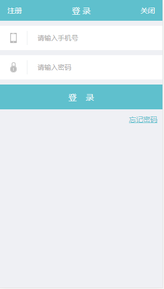
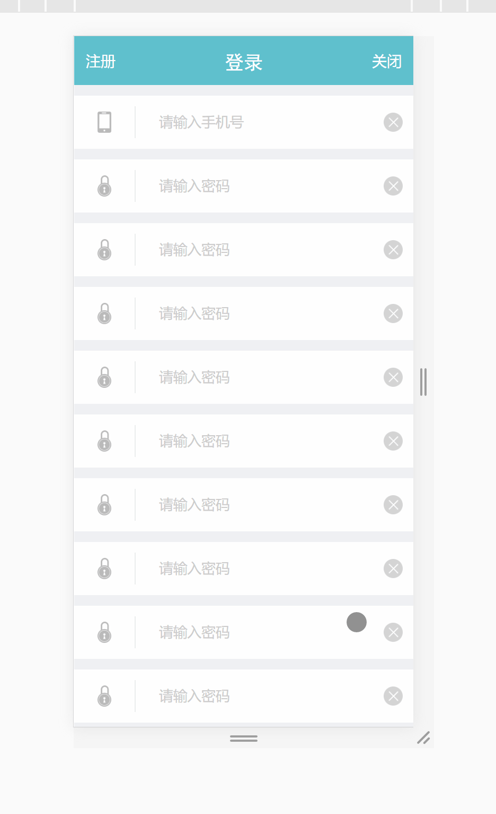

# 任务四、 一个最常见的移动端页面

## 今天完成的事情

1. 完成简单布局，然后填充界面
2. 与效果图对比优化
3. 完成验收要求：header扩展性 & 顶栏固定
4. 进行placeholder样式兼容性研究
5. 任务四-深度思考
6. task4跟随深度思考 & 师兄建议进行修改
  - 输入栏左侧换用label
  - 输入限制 电话11位，密码16位
  - 根据HTML结构的语义化修改index.html
  - 尝试main下再加一个div.content用来包裹滚动的内容

## 明天计划的事情

- [ ] 任务五计划及完成一部分
- [ ] float学习(周六学习)
  - [ ] 张鑫旭《CSS世界》相关章节
  - [ ] 张鑫旭 float系列
- [ ] 深度思考：手机分辨率和网页px的区别(TODO:周末补学)
  - [link1](http://www.cnblogs.com/yaozhongxiao/archive/2014/07/14/3842908.html)
  - [link2](https://jingyan.baidu.com/article/22a299b52586cd9e19376aa9.html)
  - [link3](http://hax.iteye.com/blog/374323)

## 遇到的问题

- FireFox60下placeholder样式修改失效
  - input:-moz-placeholder(失效)
  - input::-moz-placeholder(失效)
  - input:placeholder-shown(失效)

## 收获

### 一、 布局 & 优化

1. 明确效果：一个宽度自适应屏幕的登录界面
    
2. 步骤:
  - 1).对目标效果GIF进行截图，获得全屏效果图、425px效果图、320px效果图
  - 2).从PSD文件中导出需要的图片(phone&lock)，并用吸管工具获取界面背景色#eff0f4、登录按钮底色#5fc0cd、input中间小杠颜色#eaedee
  - 3). 开始简单界面编写
    - a. 首先是topbar, 关闭登录注册，分成三列，关闭靠左登录居中注册靠右
      - 布局：可以用float解决靠左靠右剩下一个在文档流中居中，不过按照惯例要走新一点的路，所以这里选择使用flex布局，topbar类设置justify-conent: space-around，也就是**两端对齐，项目间间隔相等**的主轴对齐方式.再设置align-items: center使三个项垂直居中.
      - 调整：
        - topbar中的文字里边有距离，这里应该用padding做填充撑起外盒，还没有测量，可以先这是html的font-size再用rem做padding填充.
        - 关闭登录注册刚开始用的是三个\<a\>标签,并且做了个去底线处理,但是中途发现登录是个title而不是链接，故筛选大小后暂时先选用\<h3\>.
    - b. 然后是container-form两个各占一行的输入：
      - 布局：由于是左icon右input的布局，所以用flex，并且这是主轴靠左，input设flex:1，完成大致布局.
      - 左侧icon：有图片做icon右边有输入栏，由于icon是图片并且有近似等高的同行小杠杠，于是设计图片左右padding+右侧border，看原型图发现右侧小杠杠似乎稍高，于是图片上下也设置一点padding来撑高右侧小杠杠，之后外面用一个div包住设置margin和行高来居中，完成左侧；
      - 右侧input:简单设置一下padding并去掉border&outline就好，在此顺便对placeholder的样式做一点探究(见下面总结)
    - c. 接着是container-form的button, 由于button的display是inline-block所以可以控制width,设置为100%,然后设置上下padding.然后"登录"之间有一个字左右的间距所以加上\&nbsp;
    - d. 最后是forgetpw,包含文字并且靠右,继续用flex,主轴flex-end，交叉轴center.设置好a标签的颜色样式

      
3. 对比优化
  - 对比
    - topbar高度不够,左右padding稍宽,登录字体不一样
    - 输入左侧icon的横向padding加一点,行高加一点
    - 登录高度不够.效果图"登录"应该是用letter-spacing做间隔的导致没居中(这个不改哈哈)
    - 忘记密码字体过大
    - GIF效果图没有做点击input显示"圆圈+x".
    - 处理：这个裁剪下PSD的图然后简单设置一下就可以简单加入输入行了.flex大法好!
  - 完成之后效果如下：
      

### 二、验收标准

1. 扩展性要求：去掉header的三块文字的任意一两个，剩下的一两个都还在原位置上不会受到影响
  - 一开始用的是flex三列布局，三个标签按照flex的justify-content: space-between;等距离分成左中右，纵向按照align-items: center;垂直居中，但是这样的样式去掉一个标签布局就会变化，去掉标签的话需要用等长的\&nbsp;来顶上才能保持标签位置不变.
  - 为了满足扩展性要求，将header改为左右float中间正常居中样式，但是实测发现浮动的a标签会占位导致中间的标签不居中(span内联包围了float),所以暂时放弃这个方案，并计划找时间学习float看看有无解决方法.
  - 根据上面方法进行修改，左右使用absolute，中间不变,轻松搞定...
2. 移动端：header始终固定顶部
  - 解决：header加fixed,给定width并设置top,完成.
  - 效果：
    

### 三、 深入思考

1. position定位有哪几种？各有什么特点 参考：[CSS 相对|绝对(relative/absolute)定位系列](http://www.zhangxinxu.com/wordpress/2010/12/css-%E7%9B%B8%E5%AF%B9%E7%BB%9D%E5%AF%B9%E5%AE%9A%E4%BD%8D%E7%B3%BB%E5%88%97%EF%BC%88%E4%B8%80%EF%BC%89/)
  - static：默认定位
    - 不可层叠,不脱离文档流
  - relative：相对当前位置定位
    - 不可层叠,不脱离文档流
    - 相对其正常位置进行定位,通过left、right、top、bottom位移
  - absolute：绝对定位
    - 包裹性：让元素由原来宽度变成自适应内部元素的宽度
    - 破坏性：脱离文档流，令原本占据的空间坍塌(布局破坏)
    - 定位：相对最近的非static父级定位,如果没有则继续向上查找直到body,通过left、right、top、bottom位移,可通过z-index进行层次分级
    - 会生成一个块级框
  - fixed：固定定位
    - 相对于浏览器viewport定位,通过left、right、top、bottom位移,可通过z-index进行层次分级
    - 会生成一个块级框
  - inherit：从父类继承position属性的值

2. 哪些css属性可以设置百分比，其计算原则是什么？
  - 参考：[MDN](https://web.archive.org/web/20150906065047/https://developer.mozilla.org/en-US/docs/Web/CSS/CSS_percentage_values)
  - 计算原则：百分比*参照值
    - Tip: 百分比值是一种相对值，任何时候要分析它的效果，都需要正确找到它的参
  - 可设置属性
    - 盒模型系列:
      - content: width(参照包含块宽度)、height(参照包含块高度)
      - padding(参照包含块宽度)
      - border
        - border-radius(参照包自身宽度&高度)
        - border-image
          - border-image-slice(参考图片尺寸)
          - border-image-width(参考自身宽度&高度)
      - margin(参照包含块宽度)
    - 定位系列：
      - left、right(参照包含块宽度)
      - top、bottom(参照包含块高度)
    - 文本系列：
      - text-indent(参照包含块宽度)
      - word-spacing(参照受影响字体宽度)
      - text-size-adjust(参考相对应文字字号)
      - font-size(参照包含父元素字号)
    - flex系列：
      - flex-basis(参考flex容器大小)
    - background系列:
      - background-position(参考背景定位区域大小-背景图片大小，其中大小指的是水平偏移的宽度和垂直偏移的高度) [图例](http://acgtofe.com/posts/2014/06/percentage-in-css)
      - background-size(相对于定位区域)

3. 常见的表单元素有哪些？各有什么属性？
  - form 表单
    - 属性
      - action: 提交表单时执行的动作，可以在此指定某个服务器表单处理脚本(如果省略action，action被设置为当前页面)
      - method: HTTP方法(GET|POST)
      - accept-charset：使用的字符集
      - autocomplete: 自动完成表单(默认开启)
      - enctype：提交数据的编码
      - novalidate：规定不验证表单
      - target：规定action属性中地址的目标(默认_self，也就是指向当前)
  - input 输入，可通过改变type变换形态 
    - 属性 其他属性参考[了解HTML表单之input元素的30个元素属性](https://www.tuicool.com/articles/7V3eqan)
      - type: text(文本) | password(密码,变圆点) | checkbox(复选框) | radio(单选)
      - html5新增属性：color & date & datetime & datetime-local & email & month & number & range & search & tel & time & url & week
  - datalist(html5) \<input\>的预定义选项列表, input的list属性引用datalist的id即可关联
    - 子元素option 待选项
  - label 标签，可以通过for属性绑定对应input的id
  - select 下拉列表
    - 子元素option 待选项
  - textarea 多行文本框, 用rows&cols控制大小
  - button 按钮，可通过改变type变换作用
    - 属性type: button(按钮) | sumbit(提交) | reset(重置)
  - fieldset 表单外框
    - 子元素legend 表单外框名称

4. 如何理解HTML结构的语义化？ 参考：[理解HTML语义化](http://www.cnblogs.com/freeyiyi1993/p/3615179.html)
  - 含义：标签有特定的意义，即**内容的结构化（内容语义化），选择合适的标签（代码语义化）**. 例如header指页面顶部栏，nav指导航栏.
  - 意义：
    - 代码结构优雅,便于阅读理解文档布局，便于开发合作维护
    - 爬虫解析方便
    - 用户体验 & 特殊设备解析(title、alt的信息注释)
  - 最佳实践：
    - 少用无意义的div&span, 无特定意义时尽量用p取代div
    - 纯样式标签用CSS替代
    - 表格标题用caption，表头用thead&th,主体用tbody&td,尾部用tfoot包围.
    - 每个input标签的对应的说明文本都要使用label标签，通过设置label的for=(input's id)即可关联

5. 使用fixed的时候，在手机上查看是否会有问题，怎么解决？
  - 这部分个人经验不足，在网上找部分案例和解决方法
    - 1)[Web移动端Fixed布局的解决方案](http://efe.baidu.com/blog/mobile-fixed-layout/)
      - 问题图片：
          
      - 问题描述：设置好上下fixed，中间普通margin与上下隔开.下拉列表超过一页，点击输入框，在软键盘唤起之后页面底部的fixed元素将失效.
      - 问题原因：软键盘唤起之后,页面fixed元素将失效，当页面超过一屏并滚动时，失效的fixed元素也会随之滚动.
      - 问题解决：
        - 思路：如果当前层级页面不滚动，那么即便fixed元素失效也无法随页面滚动.
        - 修改：中间使用absolute与上下隔开，并且y轴设置可滚动(如果出现滚动卡顿，可以加入-webkit-overflow-scrolling:touch【非标准,用于SafariMobile】)
    - 2) 其他一些问题处理
      - 输入框focus后被软键盘遮挡，可以尝试input的scrollIntoView.
      - iOS可能有坑：软键盘遮挡输入框然后在输入一条文字后重写显示输入框
      - 最好将header和footer的touchmove事件禁止，防止出发浏览器全屏模式切换导致header和footer被工具栏遮蔽.
      - 滚动到页面上下边缘时继续拖拽会将view拖走导致页面"露底".可以做一些确认边缘的判断来阻止touchmove事件的发生.
6. 常见的移动端登录页header有哪些实现方式？
  - 没找到类似的文字，总结一下我用到的
    - 简单通用flex，水平三分垂直居中
      - 特点：简单好用适合布局，但是删除元素会导致布局破坏
    - 左右float中间自动
      - 特点：使用简单,但是布局上个人不太喜欢用float
    - 左右absolute中间自动
      - 特点：暴力, 稳

### 四、探究input标签的placeholder样式

- 结果如下

  ``` css
  /* Webkit浏览器支持(非标准) https://developer.mozilla.org/zh-CN/docs/Web/CSS/::-webkit-input-placeholder */
  .form-raw input::-webkit-input-placeholder {
    color: #aaa;
  }
  /* Chrome:57+已支持去前缀 https://www.chromestatus.com/feature/6715780926275584 */
  .form-raw input::placeholder {
    color: #aaa;
  }
  /* IE10+支持  https://developer.mozilla.org/zh-CN/docs/Web/CSS/:-ms-input-placeholder */
  .form-raw input:-ms-input-placeholder {
    color: #aaa;
  }
  /* Firefox 4-18 */
  .form-raw input:-moz-placeholder {
    color: #aaa;
  }
  /* 很奇怪， FireFox60实测不支持 */
  /* Firefox 19+(非标准) https://developer.mozilla.org/zh-CN/docs/Web/CSS/::-moz-placeholder*/
  .form-raw input::-moz-placeholder {
    color: #aaa;
  }
  /* 实验中特性 https://developer.mozilla.org/en-US/docs/Web/CSS/:placeholder-shown */
  .form-raw input:placeholder-shown {
    color: #aaa;
    /* border: 2px solid red; */   /* border有效并且只有在Firefox有效*/
  }
  ```